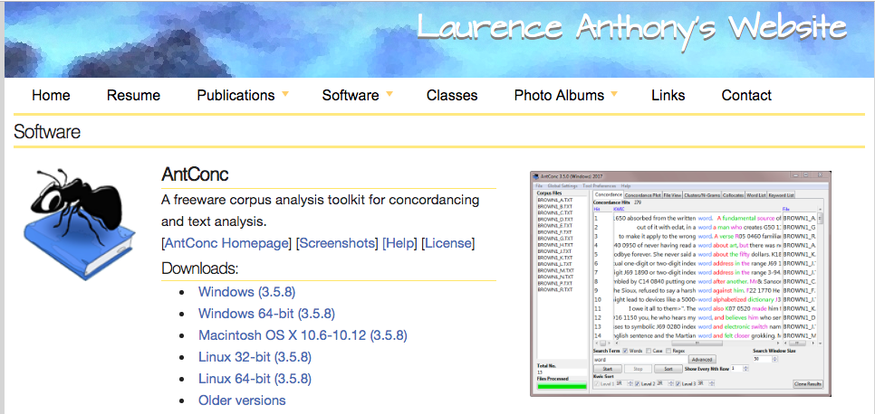

<!-- @import "[TOC]" {cmd="toc" depthFrom=1 depthTo=6 orderedList=false} -->
<!-- code_chunk_output -->

* [Schedule, Friday, 5 July: Visualisation and Text Analysis of Edition Data](#schedule-friday-5-july-visualisation-and-text-analysis-of-edition-data)
* [Aims](#aims)
* [Readings](#readings)
* [Seminar 12](#seminar-12)
	* [Current web- and app-based vis tools](#current-web-and-app-based-vis-tools)
	* [Introduction to R](#introduction-to-r)
* [Seminar 13](#seminar-13)
	* [Using R to visualise text data](#using-r-to-visualise-text-data)

<!-- /code_chunk_output -->

Today will survey some visualisation tools for texts. It will also provide a general introduction to the R programming language, with libraries focusing on text analysis and visualisation.

## Schedule, Friday, 5 July: Visualisation and Text Analysis of Edition Data

|Time   | Topic   | Type |
|---|---|---|
|9.30	| Seminar 12: Current web-based vis tools; Intro to R | Presentation |
| 11.30	| Seminar 13: Using R to visualise text data; course wrap-up | Presentation |

## Aims

- Understand some of the options for visualising text material.
- Understand the value of using programming languages as part of edition planning.
- Working knowledge of the basic syntax of the R programming language, and the ability to modify existing text analysis code.

## Readings

Taylor Arnold and Lauren Tilton, [Basic Text Programming in R](https://programminghistorian.org/en/lessons/basic-text-processing-in-r), in the *Programming Historian* (https://programminghistorian.org).

Stefan Gries, [*Quantitative Corpus Linguistics with R*](https://www.amazon.co.uk/Quantitative-Corpus-Linguistics-Stefan-Gries/dp/1138816280/ref=dp_ob_title_bk). Routledge, 2016 (2nd ed.).

Matthew Jockers, [*Text Analysis with R for Students of Literature*](https://www.springer.com/gp/book/9783319031637). Springer, 2014. [Especially Chapter 8, on XML processing]

## Seminar 12

### Current web- and app-based vis tools

**Voyant Tools**

1. Go to [https://voyant-tools.org/](https://voyant-tools.org/).
2. Start by uploading the [Bad Hamlet file](bad-hamlet.xml) (click on the "Upload" icon).

3. What do you notice about the results?
4. Now try another file with some different encoding: [Chapters 20-21 of *Billy Budd*](billy-budd-chs20-21.xml), a heavily revised part of the manuscript.

[Click here](text-conv.xsl) for the text conversion xslt.

For more information on Voyant, check out Miriam Posner's Voyant tutorial [here](https://github.com/miriamposner/voyant-workshop/blob/master/investigating-texts-with-voyant.md).

**AntConc**

[AntConc](http://www.laurenceanthony.net/software.html) is a corpus linguistics tool that can be downloaded for free on your machine.

This tool is very good for providing raw word frequencies on multiple files, as well as supplying phrase-level searching and parts-of-speech tagging.

We won't have time to investigate this tool, but if you would like to learn more, the [Programming Historian](https://programminghistorian.org/en/lessons/corpus-analysis-with-antconc) has an excellent online tutorial on AntConc by Heather Froehlich.

### Introduction to R

[Click here](readings/R-intro-notebook1-lrbs.Rmd) to download the Intro to R Notebook for this session.

And [click here](/readings/R-intro-notebook1-lrbs.nb.html) to access an HTML version of the Notebook.

## Seminar 13

### Using R to visualise text data

For the rest of this session, we will be using the second R Notebook on using tidy text and the XML libraries to visualise edition data, which can be downloaded [here](/readings/R-intro-notebook2-lrbs.Rmd).

Click [here](/readings/R-intro-notebook2-lrbs.nb.html) to access the HTML version of the notebook.

You probably noticed the introduction of regular expressions (regex) the past two days. Here is the link to [Regex101.com](https://regex101.com/), the online regex tester that I showed.

(Note: Access the marginalia XML [here](460-markings-only.xml).)
