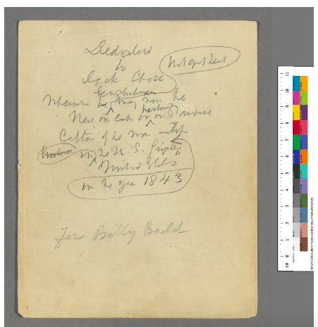

<!-- @import "[TOC]" {cmd="toc" depthFrom=1 depthTo=6 orderedList=false} -->
<!-- code_chunk_output -->

* [Schedule, Monday, 1 July: Welcome, TEI refresher](#schedule-monday-1-july-welcome-tei-refresher)
	* [A little housekeeping](#a-little-housekeeping)
	* [Readings](#readings)
	* [Seminar 1](#seminar-1)
		* [Editorial / TEI primer](#editorial-tei-primer)
		* [Misconceptions of TEI](#misconceptions-of-tei)
		* [Exercise: Editing Basil Bunting's Final Notebook](#exercise-editing-basil-buntings-final-notebook)
		* [Optional/alternate exercise: multi-modal *Moby-Dick*](#optionalalternate-exercise-multi-modal-moby-dick)
	* [Seminar 2: Project Planning and Development](#seminar-2-project-planning-and-development)
		* [Exercise](#exercise)

<!-- /code_chunk_output -->

# Schedule, Monday, 1 July: Welcome, TEI refresher

|Time   | Topic   | Type |
|---|---|---|
|12.30	| Registration | |
| 13.00	  | Senate House Library Talk	| Presentation |
| 14.00 | Seminar 1: Welcome; editorial/TEI primer; misconceptions of TEI [CO] | Presentation |
| 15.00 | Exercise 1: Editing a text in TEI: Basil Bunting's final notebook; multi-modal *Moby-Dick* | Practice |
| 16.00 | Seminar 2: Advanced project planning and development: working with authority lists, writing encoding guidelines, file naming, etc. [LW] | Presentation |

## A little housekeeping

**oXygen:** You will need to use **oXygen XML editor** for most of this week, starting today. The machines at IHR Training Suite should have oXygen installed. If you need to install the editor (the editor only), go to [https://www.oxygenxml.com/xml_editor/download_oxygenxml_editor.html](https://www.oxygenxml.com/xml_editor/download_oxygenxml_editor.html).

The team at oXygen has generously given trial licenses for you: copy and paste the full license [here](oxygen-license.txt).

**R and RStudio:** For Friday's session, we will be using R, so you will need to download R and its integrated development environment (IDE), RStudio.

 * Download R [here](https://cran.r-project.org/mirrors.html) and select the appropriate CRAN mirror (near where you live).
 * Then choose the appropriate download for your operating system.
 * Download RStudio [here](https://www.rstudio.com/products/rstudio/download/#download).

**Module web site:** This site will be open and free to use in perpetuity. It is designed for you to consult long after you have finished the course. That said, it is currently an organic (and static) site, so throughout the week I will be revising content, which means you should refresh the page you're on before each session. Sometimes the browser cache will show you older versions of the site, so it is good practice to clear your cache at the beginning of each day (do this by clearing your browser history).

## Readings

1. Hans Walter Gabler, ["Theorizing the Digital Scholarly Edition,"](https://www.openbookpublishers.com/htmlreader/978-1-78374-363-6/ch6.html#_idTextAnchor018) in *Text Genetics...* (Open Book, 2018).
2. Elena Pierazzo, *Digital Scholarly Editing* (Ashagte, 2015), ch 5 (on workflow)
3. Tara Andrews, ["The Third Way: Philology and Critical Edition for a Digital Age"](https://brill.com/view/book/edcoll/9789401209021/B9789401209021-s006.xml), *Variants* 10 (2013): 61–76.
4. James Cummings, ["Misconceptions of the TEI"](/readings/cummings2018-myths-of-tei.pdf), *Digital Scholarship in the Humanities* 2018.

## Seminar 1

### Editorial / TEI primer

**Lecture notes:**

* **What is the purpose of a digital edition?**
  - Something to be read or used?
  - *Classical* and *digital thinking*: output-driven (constrained by print) v. user-centric design (constrained by technology and resources?). See [Rehbein 2008](http://computerphilologie.tu-darmstadt.de/jg08/rehbein.pdf).
  - Modelling comes before editing, according to this view. This is the analytical process of establishing the editorial principles and the purpose of the edition, including its intended audience (For more on modelling, see the Day 2 notes from the [Intro module](https://cmohge1.github.io/lrbs-digital-editing-intro-2019/day2/#text-modelling).)
  - "why-what-how" approach of functional and semantic modelling. Note how the "why" question comes first.
  - declaration of principles based on the documents but also the formal computational model of the edition.
  - the tyranny of the page: think first about "page" design (traditional) or think about comutational features?
  - Wireframing:

|Site Banner                     |
|---|
| Home &nbsp; &nbsp; &nbsp; &nbsp; &nbsp;  About &nbsp; &nbsp; &nbsp; &nbsp; &nbsp; &nbsp;  Editions &nbsp; &nbsp; &nbsp; &nbsp; &nbsp; &nbsp;  Search &nbsp; &nbsp; &nbsp; &nbsp; &nbsp; &nbsp; Contact   |

|Text Menu | Text Transcription | Facsimile |
|---|---|---|
|Item1   Item2   Item3  | Transcribed text...  |    |

|&nbsp; &nbsp; &nbsp; &nbsp; &nbsp; &nbsp; &nbsp; &nbsp; &nbsp; &nbsp; &nbsp; Footer &nbsp; &nbsp; &nbsp; &nbsp; &nbsp; |
|---|
|&nbsp; &nbsp; &nbsp; &nbsp; &nbsp; &nbsp; &nbsp; &nbsp; &nbsp; &nbsp; Site information &nbsp; &nbsp; &nbsp; &nbsp; &nbsp; |

* [Click here](MEL.pdf) for an example of a recent wireframe created by Performant Software for a re-design of the Melville Electronic Library. And see how it compares to what was eventually adopted at [https://mel.hofstra.edu/](https://mel.hofstra.edu/) for the re-design (image courtesy Nick Laiacona).

* But of course this is an interface-driven approach to the "what" question. It also depends on whether you see your project as text-driven or archive-driven (for more on this, see [Price 2009](http://www.digitalhumanities.org/dhq/vol/3/3/000053/000053.html).)

* Edition as image and data (Buzzetti 2009):
  - nature of documents and editorial principles (for more on this consult the [Intro module](https://cmohge1.github.io/lrbs-digital-editing-intro-2019/))
  - list of features and analysis tools (what)
  - list of parameters: what in the data should be featured in the interface
  - list of research questions and aims
  - list of user needs
  - technological requirements and available resources (static or live, life expectancy, management)
* Edition as analysis (Ohge and Tupman, forthcoming 2020):
	- Sometimes too much emphasis on text structure and presentation
	- Computers can "read" in new ways, after all, particularly in ways that our brains are lacking.
	- An analysis-driven approach: many researchers in digital humanities have practised encoding and text analysis as separate tasks. But what exactly is text analysis and why do it in an editing project? Text analysis is a computer-assisted calculation of word counts and various other statistics in a textual corpus––e.g. word and sentence lengths, lexical uniqueness, unique word frequencies, parts-of-speech tagging, average word use, sentiments, and topics. (We'll cover this on [Day 5](day5.md).)
	- How do the materials cohere with the methods of textual scholarship? What is the purpose of doing this edition? What are the arguments about the best way to organize and present the texts? What are the arguments for the significance of the text, and the priorities of its audience, and how will that affect our encoding choices? What analytical tools could enhance our understanding and demonstrate the significance of the research?
		- Planning your project + documentation
		- Project analysis + documentation
		- Document analysis + documentation
		- Text analysis evaluation + documentation
		- Transcription and markup + documentation
		- Error checking + documentation
		- Post-processing + documentation

* **Computer-assisted philology v. Digital Philology** (cf. Pierazzo, Andrews)
  - Philology: textual scholarship (interpreting the history of text structures and meanings), but also the branch of knowledge that deals with the structure, historical development, and relationships
of languages or language families
  - Computer-assisted philology emphasises the use of computers to speed up or enhance traditional editorial tasks; tool-building and out-of-the-box solutions
  - Digital philology: the editor takes more responsibility over the coding and design.
  - How much coding knowledge should the editor possess? (Andrews v. Pierazzo's "third way.")

* **Edition as a web of knowledge** (cf. Gabler)

* **TEI for standards and accountability**
	- Provides a summary of editorial intervention in more direct ways that were hitherto not possible in print.
	- Documentation of choices by community standards ensures accountability and re-usability.
	- Richness and flexibility both an advantage and a disadvantage.
	- Overlapping hierarchies, and the stand-off markup approach (see [Egan 2014](https://www.gabrielegan.com/publications/Egan2014e.pdf) and [Schmidt 2010](https://www.researchgate.net/publication/220675402_The_inadequacy_of_embedded_markup_for_cultural_heritage_texts)).

### Misconceptions of TEI

**Lecture notes:**
* TEI aspires to generality and flexibility; however,
 it is not everything for everyone.
* Cummings: "it formalizes a history of the community’s concerns for textual distinctions and exemplifies understandings of how to encode them and how these have developed over its existence; it acts as a slowly developing consensus-based method of structuring those distinctions..."
* Some misconceptions:
  - The TEI is XML (and XML is broken or dead)
  ("What is written in
the Guidelines in prose is more important than the
rules of any generated schema").
  - The TEI is too big and complex ("the TEI is a
modular framework that allows a project, or a subcommunity to choose precisely which elements to make available and where appropriate build processing workflows based on only those elements.")
  - The TEI is too simple or general ("any individual element can be further refined by using attributes or nested levels of encoding ... [and] a TEI customization is expected to document its own controlled vocabulary.")
  - There is no way to change the TEI ("The TEI Guidelines document a literate programming methodology to customize the TEI framework for specific projects.")
  - You have to be a TEI guru to customize the TEI (tools like Roma and RomaJS [in BETA].)
  - The TEI is too small (or does not have `<mySpecialElement>`). ("... what makes the TEI different from most other standards
is that any user may add new elements to it and
do so in a manner (using the TEI ODD customization
format) which fully integrates it into the TEI
infrastructure and acts as documentation for how
their project’s outputs vary from the version of the
TEI that they are using.")
  - You cannot get from TEI to $myPreferredFormat (remember the importance of source data.)
  - If you use TEI you must learn other technologies (value collaboration, and think about varieties of XML technologies.)
  - You cannot do stand-off markup in XML (or TEI). See the `<link>`, `<join>`, and `<prefixDef>` elements, and the `@part` attribute.
  -  XML (and TEI) cannot handle overlapping hierarchies
  - There are no tools for the TEI
  - Interoperability is impossible with the TEI
  - The TEI is only for digital editions, I am doing $otherThing
  - The TEI is only for Anglophone or Western works
*

### Exercise: Editing Basil Bunting's Final Notebook

1. Download the images of the first few pages of the notebook (please note that these images are the purposes of this exercise only and are not to be distributed.)
    - [Page 4](bunting-nb-p4.jpg)
    - [Page 5](bunting-nb-p5.jpg)
    - [Page 6](bunting-nb-p6.jpg)

2. Create a list following the what-why-how principles of modelling an edition.
3. Download the [xml file](bunting_last-notebook.xml) of the notebook's first few pages, with partial transcription and minimal encoding in TEI.
4. Encode as many features in TEI as you see fit, based on your modelling exercise in (1).
5. Sketch out a wireframe (either on paper or digitally) of a proposed interface for the edition.

If you need any help with TEI encoding, consult the TEI workshop slides produced by co-tutor Tiago Sousa Garcia for the [ATNU-IES Textual Editing in the Digital Workshops](https://research.ncl.ac.uk/atnu/news/textualeditinginthedigitalage.html), including:
- [TEI core modules](https://docs.google.com/presentation/d/1c-Ozi1OoXXknYkNM_1Hpt5e8LxtswgoUeONDQ25iuX8/edit?usp=sharing)
- [TEI for transcription](https://docs.google.com/presentation/d/1770nlJA3wYnjR1GSpELV2Dz8DIIJ4B-s-IYZkkmke7Y/edit?usp=sharing)

See also the [TEI Guidelines](https://www.tei-c.org/release/doc/tei-p5-doc/en/html/index.html).

Check out the [spoiler file](bunting_last-notebook_spoiler.xml).

### Optional/alternate exercise: multi-modal *Moby-Dick*

1. Download Chapter 108 of *Moby-Dick*, which features several kinds of textual and contextual phenomena.
2. What TEI modules would you choose for this chapter? What kinds of encoding would suit this material?
3. Encode as many features in TEI as you see fit, based on your modelling exercise in (1).
4. Sketch out a wireframe (either on paper or digitally) of a proposed interface for the edition.

If you want to compare this to two example interfaces, see the *Moby-Dick* [reading text](https://mel-juxta-editions.herokuapp.com/documents/465) or the [American v. British parallel text](https://mel.hofstra.edu/juxta/moby-dick/0/110/sbs?compareTo=1), both on the Melville Electronic Library.   

## Seminar 2: Project Planning and Development

1. Download this [zip file](ExampleProject_July2019.zip) of an example project directory.
2. Download the [slides](PlanningYourProject_Williamson_July2019.pdf).

### Exercise

Follow the exercise instructions on the slides.

Proceed to to [Day 2](day2.md).
