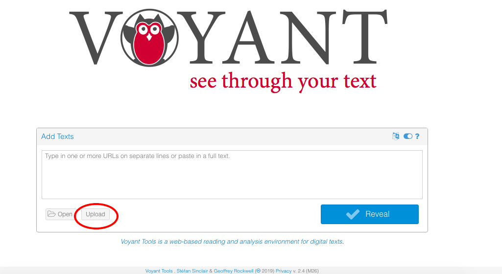
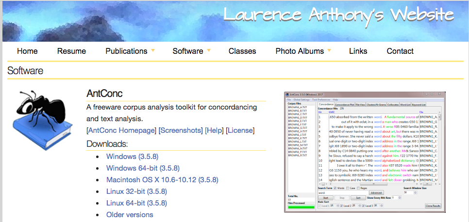

# Day 5 (5 July)

Today will survey some visualisation tools for texts. It will also provide a general introduction to the R programming language, with libraries focusing on text analysis and visualisation.

## Aims

- Understand some of the options for visualising text material.
- Understand the value of using programming languages as part of edition planning.
- Working knowledge of the basic syntax of the R programming language, and the ability to modify existing text analysis code.

## Day 5 (5 July): Visualisation and Text Analysis of Edition Data

|Time   | Topic   | Type |
|---|---|---|
|9.30	| Seminar 12: Current web-based vis tools; Intro to R | Presentation |
| 11.30	| Seminar 13: Using R to visualise text data; course wrap-up | Presentation |

### Seminar 12

#### Current web- and app-based vis tools

**Voyant Tools**

1. Go to [https://voyant-tools.org/](https://voyant-tools.org/).
2. Start by uploading the [Bad Hamlet file](bad-hamlet.xml) (click on the "Upload" icon).
.
3. What do you notice about the results?
4. Now try another file with some different encoding: [Chapters 20-21 of *Billy Budd*](billy-budd-chs20-21.xml), a heavily revised part of the manuscript.

[Click here](text-conv.xsl) for the text conversion xslt.

**AntConc**

[AntConc](http://www.laurenceanthony.net/software.html) is a corpus linguistics tool that can be downloaded for free on your machine.

This tool is very good for providing raw word frequencies on multiple files, as well as supplying phrase-level searching and parts-of-speech tagging.

#### Introduction to R

[Click here](R-intro-notebook1-lrbs.Rmd) to download the R Notebook for this session.

And [click here](R-intro-notebook1-lrbs.nb.html) to access an HTML version of the Notebook.

### Seminar 13

#### Using R to visualise text data

For the rest of this session, we will be using an R Notebook, which can be downloaded [here]().

Click [here]() to access the HTML version of the notebook.
